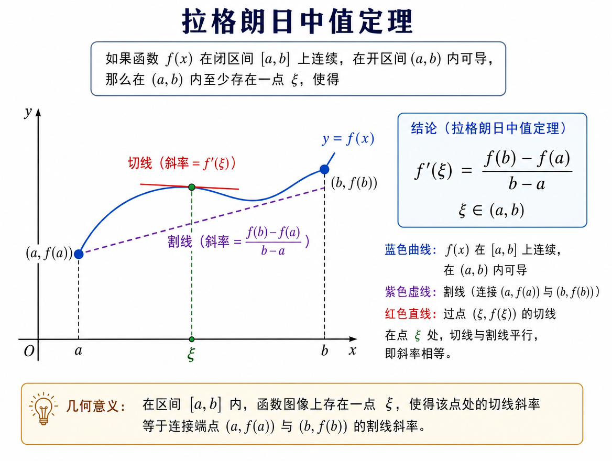
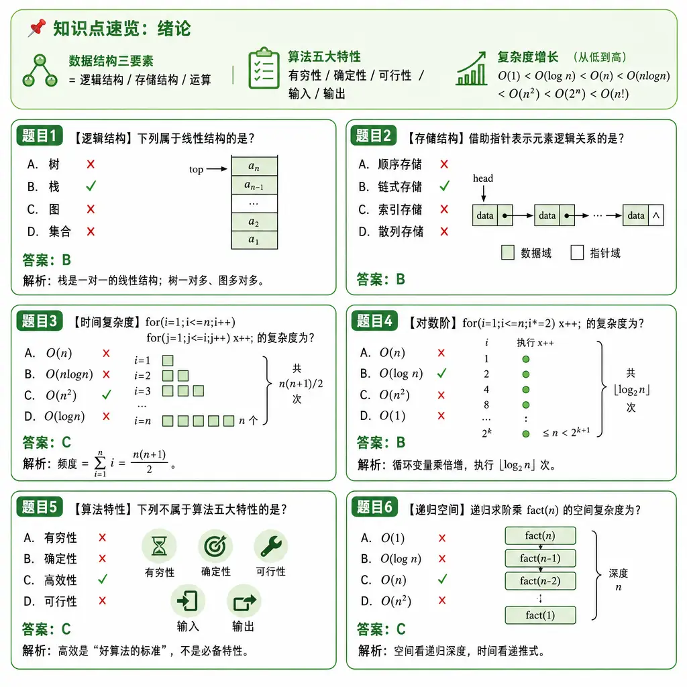
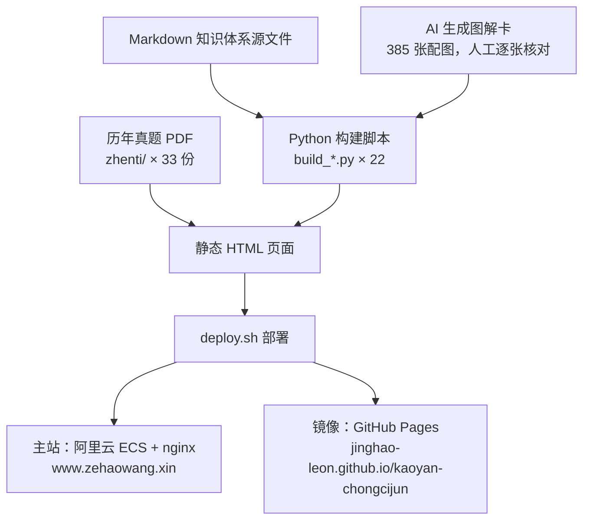

<div align="center">

# 考研冲刺君 · 免费考研知识库

**408 计算机 / 数学一 / 英语一 —— 全部考点体系化讲解、图解例题卡、历年真题 PDF（2014—2024），浏览器打开即用，全部免费**

[](https://jinghao-leon.github.io/kaoyan-chongcijun/)
[](https://github.com/JingHao-Leon/kaoyan-chongcijun/commits/main)
[](https://github.com/JingHao-Leon/kaoyan-chongcijun)
[](https://github.com/JingHao-Leon/kaoyan-chongcijun)
[](LICENSE)

[](https://www.zehaowang.xin)

</div>

---

纯静态站点，无注册、无付费墙：**25 章 408 知识体系 + 150 道例题卡、22 章数学一全解、英语一方法论与 5000 核心词汇、33 份历年真题 PDF**，另有 69 张 AI 生成并人工逐张核对的知识图解。

**主站（ICP 备案，每日更新）**：https://www.zehaowang.xin
**备用镜像（GitHub Pages）**：https://jinghao-leon.github.io/kaoyan-chongcijun/

## ✨ 内容亮点

<table>
<tr>
<td width="50%">

### 💻 408 计算机（150 分）
数据结构 / 组成原理 / 操作系统 / 计算机网络四门 **25 章知识体系全解**，Cache 映射、IEEE 754、PV 操作、TCP 拥塞控制等难点全部配图解，每章 6 道例题卡。

</td>
<td width="50%">

### 📐 数学一（150 分）
**高数 8 章 + 线代 6 章 + 概率统计 8 章**共 22 章全解，KaTeX 渲染公式，16 张数学难点图解卡（中值定理、链式法则等）。

</td>
</tr>
<tr>
<td width="50%">

### 📖 英语一（100 分）
阅读六大题型、完形、翻译、作文模板**方法论全解**，外加 **5000 核心词汇库**与历年真题原文库。

</td>
<td width="50%">

### 🗂️ 真题速查与下载
**33 份真题 PDF（2014—2024）** 一站下载；408 / 数学一支持**分章 × 分年**交叉速查，2024 年 408 选择题有逐题解析。

</td>
</tr>
</table>

## 🖼️ 图解卡示例

<div align="center">

&nbsp;

<br><em>左：数学难点图解卡 ｜ 右：408 例题卡（全站共 385 张配图，AI 生成 + 人工核对）</em>
</div>

## 🧭 内容总览

### 408 计算机学科专业基础（150 分）

| 科目 | 分值 | 页面 | 内容 |
|------|------|------|------|
| 数据结构 | 45 分 | [ds.html](https://www.zehaowang.xin/ds.html) | 7 章知识体系 + 图解卡 + 每章 6 道例题卡 + 真题 |
| 计算机组成原理 | 45 分 | [co.html](https://www.zehaowang.xin/co.html) | Cache 映射、IEEE 754、流水线等难点图解 |
| 操作系统 | 35 分 | [os.html](https://www.zehaowang.xin/os.html) | PV 操作、页面置换、磁盘调度图解 |
| 计算机网络 | 25 分 | [cn.html](https://www.zehaowang.xin/cn.html) | TCP 握手、拥塞控制、子网划分图解 |

- [408 四门课总览页](https://www.zehaowang.xin/cs408.html)
- [2024 年 408 选择题逐题解析](https://www.zehaowang.xin/408_choice.html)
- [408 分章分年真题速查（2014—2024）](https://www.zehaowang.xin/408_chapter_lookup.html)

### 数学一（150 分）

- [数学一 22 章知识体系全解](https://www.zehaowang.xin/math1.html)：高数 8 章 + 线代 6 章 + 概率统计 8 章
- [数学一分章真题速查](https://www.zehaowang.xin/math_chapter_lookup.html) · [数学一历年真题](https://www.zehaowang.xin/math_pastpapers.html)

### 英语一（100 分）

- [英语一方法论全解](https://www.zehaowang.xin/english1.html)：阅读六大题型、完形翻译、作文模板
- [5000 核心词汇库](https://www.zehaowang.xin/english5000.html) · [真题原文库](https://www.zehaowang.xin/english_pastpapers.html)

### 真题下载与备考专题

- [历年真题 PDF 下载页（408 / 数学一 / 英语一，共 33 份）](https://www.zehaowang.xin/zhenti/)
- [备考专题](https://www.zehaowang.xin/topics.html)：题型结构数据解析、全年三阶段复习规划（持续更新）

## 🏗️ 站点如何构建

知识体系源文件为 Markdown，由仓库内的 Python 构建脚本转成 HTML 并嵌入图解卡与真题面板；产物是纯静态页面，双通道发布：



## 🚀 快速上手

纯静态站点，无构建、无依赖，克隆后即可本地浏览：

```bash
git clone https://github.com/JingHao-Leon/kaoyan-chongcijun.git
cd kaoyan-chongcijun

# 方式一：直接用浏览器打开 index.html
# 方式二：起一个本地静态服务（推荐，真题 iframe 等功能更完整）
python3 -m http.server 8000
# 打开 http://localhost:8000
```

如需重新生成某个内容页面，运行对应的构建脚本，例如：

```bash
python3 build_math_chapter_lookup.py   # 重新生成数学一分章真题速查页
python3 build_408_chapter_lookup.py    # 重新生成 408 分章真题速查页
```

## 📁 仓库结构

```
├── index.html                  # 首页：内容导航 + 亮点卡片 + 目标分数工具
├── cs408.html / ds.html / co.html / os.html / cn.html   # 408 总览 + 四门课体系页
├── math1.html                  # 数学一 22 章知识体系全解
├── english1.html               # 英语一方法论全解
├── 408_choice.html             # 2024 年 408 选择题逐题解析
├── 408_chapter_lookup.html     # 408 分章 × 分年真题速查（2014—2024）
├── math_chapter_lookup.html    # 数学一分章真题速查
├── math_pastpapers.html        # 数学一历年真题
├── english5000.html            # 英语一 5000 核心词汇库
├── english_pastpapers.html     # 英语一真题原文库
├── topics.html                 # 备考专题入口
├── articles/                   # 专题文章（题型结构解析 × 2、复习规划 × 1）
├── zhenti/                     # 33 份历年真题 PDF（408 / 数学一 / 英语一）
├── images/                     # 385 张图解卡与例题卡配图（webp/png）
├── assets/                     # style.css + 交互脚本（导航、章节模式、互动实验）
├── build_*.py                  # 22 个页面构建脚本（Markdown/数据 → HTML）
├── deploy.sh                   # 部署脚本（阿里云主站 + Pages 镜像）
├── llms.txt / sitemap.xml / feed.xml / robots.txt   # SEO/GEO 配套
└── LICENSE                     # MIT
```

## 🔧 技术说明

- 纯静态站点（HTML + CSS + 原生 JS + KaTeX），阿里云 nginx 托管 + GitHub Pages 镜像，支持暗色模式
- 408 各科目页内置交互式演示（`assets/interactive-labs.js`），如 Cache 映射、页面置换过程可动手操作
- SEO/GEO：JSON-LD 结构化数据、`llms.txt`、`sitemap.xml`、RSS（`feed.xml`）、FAQPage、BreadcrumbList
- 图解卡与例题卡图片由 AI 生成并经人工逐张核对

## 📅 更新日志

本站**每日更新**，最近更新：

- **2026-07-29**：备考专题区上线（题型结构数据解析 × 2、全年复习规划 × 1）；真题 PDF 下载页上线；全站 GEO/SEO 改造（结构化数据、FAQ、速览摘要、面包屑）
- **2026-07-26**：16 张数学难点图解卡上线；25 章 408 知识点图解 + 150 道例题卡全部上线
- **2026-07-25**：网站上线（阿里云 ECS + HTTPS）；GitHub Pages 镜像部署

## ⚠️ 声明与局限

- 本站内容仅供学习交流使用，**历年真题版权归原命题单位所有**；仓库代码以 [MIT](LICENSE) 协议开源。
- 图解卡与例题卡为 AI 辅助生成，虽经人工逐张核对，仍可能存在疏漏，**请以官方考纲与教材为准**；发现错误欢迎提 Issue。
- 分章真题速查按章节考点归集，不同年份题号会变化，请结合章节考点定位。

## 关键词

考研408、408真题、408真题pdf、数据结构考研、计算机组成原理考研、操作系统考研、计算机网络考研、数学一真题、数学一知识点、英语一真题、考研英语词汇、考研复习资料

---

<div align="center">
<sub>
主站：<a href="https://www.zehaowang.xin">www.zehaowang.xin</a> ｜ 镜像：<a href="https://jinghao-leon.github.io/kaoyan-chongcijun/">GitHub Pages</a> ｜ 每日更新 · 全部免费<br>
如果对你有帮助，欢迎 ⭐ Star 支持一下
</sub>
</div>
